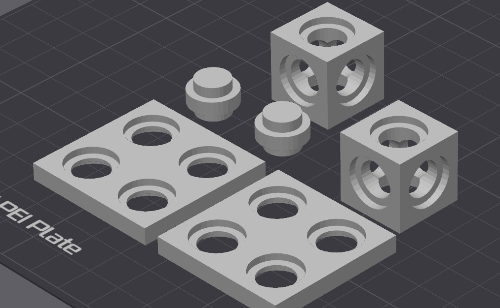

<div align="center">

🌐 **English** | [Português](README.md)

# FusionBrick

**Open-source modular design system for makers, engineers and builders.**

*Build smarter. Print faster. Connect everything.*

[](LICENSE)
[](https://openscad.org)
[](https://makerworld.com)
[](CHANGELOG.md)

</div>

---

## What is FusionBrick?

FusionBrick is a **parametric modular design system** for 3D printing. It provides a set of interlocking pieces — called **Bricks** — that connect in any direction, on any face, without tools.

Inspired by the simplicity of LEGO and the precision of engineering, FusionBrick is designed for:

- ⚡ **Rapid prototyping** of electronics cases, structures and brackets
- 🔩 **Press-fit assembly** — no screws, no glue required
- 📐 **Parametric design** — every dimension is a variable
- 🌐 **Open source** — fork it, extend it, share it

---

## Core Concepts

FusionBrick is built around one rule:

> **Any piece connects to any other piece, on any face, in any direction.**

Every Brick has holes on all 6 faces following the same grid pattern. A **Link** (separate connector piece) joins any two holes together — press-fit for prototyping, glued for permanent builds.



---

## The Pieces

| Piece | Description | File |
|---|---|---|
| **ATOM** | Cubic structural unit. Holes on all 6 faces. | `core/atom.scad` |
| **PLATE** | Flat modular surface. Grid-aligned holes. | `core/plate.scad` |
| **LINK** | Universal connector. Joins any two holes. | `core/link.scad` |
| **BRIDGE** | Joins two coplanar PLATEs side by side. | `core/bridge.scad` |
| **CORNER** | Joins two PLATEs at 90°. | `core/corner.scad` |

---

## System Parameters

All pieces share the same global parameters. **Keep them equal across pieces to guarantee compatibility.**

```
cell_size     = 20mm   // base grid unit
hole_d        = 10mm   // hole diameter
relief_depth  = 2mm    // countersink depth
relief_margin = 2mm    // countersink margin
tolerance     = 0.2mm  // print fit tolerance
```

> **Compatibility rule:** if `cell_size`, `hole_d` and `relief_*` are equal across pieces, all holes align perfectly — no matter which pieces you combine.

---

## Quick Start

### Requirements
- [OpenSCAD](https://openscad.org/downloads.html) 2021+
- Any FDM printer (tested on Bambu Lab A1 Mini)
- PLA or PETG filament

### Print your first ATOM

1. Clone the repository
```bash
git clone https://github.com/wguilherme/fusionbrick.git
```

2. Open in OpenSCAD
```bash
cd fusionbrick
open implementations/openscad/core/atom.scad
```

3. Render and export STL
```
Press F6 to render → File → Export → Export as STL
```

4. Slice and print
   - Layer height: `0.2mm`
   - Infill: `20%+`
   - Supports: `No`

### Or use pre-exported STLs
Pre-built STL files are available in the `builds/stl/` folder.

---

## Project Structure

```
fusionbrick/
├── spec/                    ← Generic specification (tech-agnostic)
│   ├── system.md
│   ├── parameters.md
│   └── pieces/
│       ├── atom.md
│       ├── plate.md
│       ├── link.md
│       ├── bridge.md
│       └── corner.md
│
├── implementations/
│   ├── openscad/            ← OpenSCAD implementation ✅
│   │   ├── params/
│   │   │   └── globals.scad
│   │   ├── lib/
│   │   │   ├── holes.scad
│   │   │   └── rounded.scad
│   │   └── core/
│   │       ├── atom.scad
│   │       ├── plate.scad
│   │       ├── link.scad
│   │       ├── bridge.scad
│   │       └── corner.scad
│   ├── fusion360/           ← Coming soon
│   └── makerworld/          ← PMM-ready files
│
├── builds/
│   └── stl/                 ← Pre-exported STL files
│
├── assemblies/              ← Example builds
└── docs/                    ← Documentation and renders
```

---

## Roadmap

### v0.1.0 — Foundation ✅
- [x] ATOM — cubic unit
- [x] PLATE — flat surface
- [x] LINK — universal connector
- [x] BRIDGE — coplanar join
- [x] CORNER — 90° join
- [x] OpenSCAD implementation
- [x] System specification

### v0.2.0 — Parametric
- [ ] Hole pattern selection (all, edges, corners)
- [ ] Multi-scale support (10mm, 20mm, 30mm grid)
- [ ] MakerWorld PMM upload

### v0.3.0 — Connected
- [ ] Electrical conduction channels
- [ ] Magnetic snap connectors
- [ ] Wireless integration layer

### v1.0.0 — Plugin
- [ ] Fusion 360 plugin — apply pattern to any surface
- [ ] Auto-split for large models
- [ ] Community blueprint library

---

## Implementations

FusionBrick follows a **spec-first** approach. The `spec/` folder defines the system contract — any CAD tool can implement it.

| Implementation | Status | Maintainer |
|---|---|---|
| OpenSCAD | ✅ Active | @wguilherme |
| Fusion 360 | 🔜 Planned | — |
| FreeCAD | 🔜 Planned | — |
| MakerWorld PMM | 🔜 Planned | — |

Want to add a new implementation? Read [CONTRIBUTING.md](CONTRIBUTING.md).

---

## Contributing

FusionBrick is open source and community-driven.

- 🐛 **Found a bug?** Open an [issue](https://github.com/wguilherme/fusionbrick/issues)
- 💡 **Have an idea?** Start a [discussion](https://github.com/wguilherme/fusionbrick/discussions)
- 🔧 **Want to contribute?** Read [CONTRIBUTING.md](CONTRIBUTING.md)
- 🖨️ **Printed something cool?** Share it on MakerWorld tagging **#fusionbrick**

---

## License

FusionBrick is released under the [MIT License](LICENSE).

Free to use, modify and distribute — personal and commercial.

---

<div align="center">

**FusionBrick** — *Build smarter. Print faster. Connect everything.*

Made with ❤️ by makers, for makers.

</div>