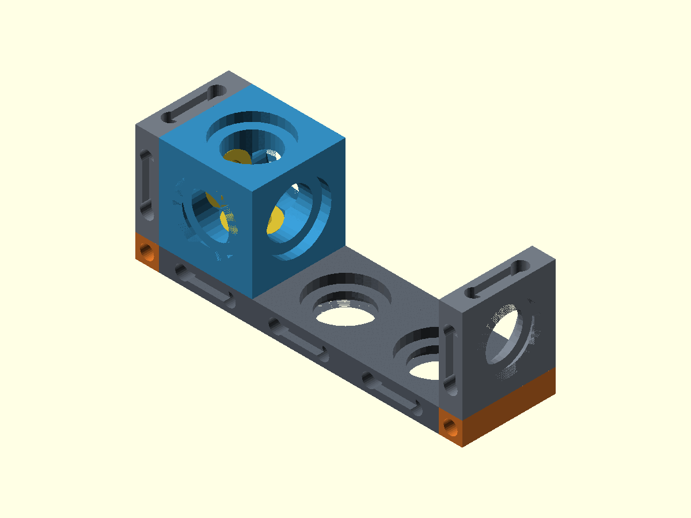
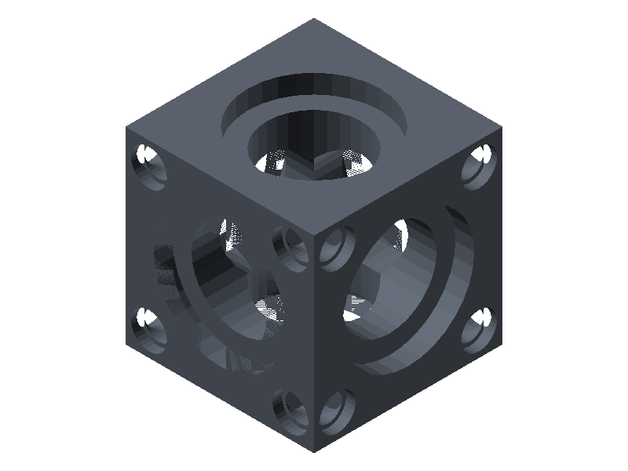
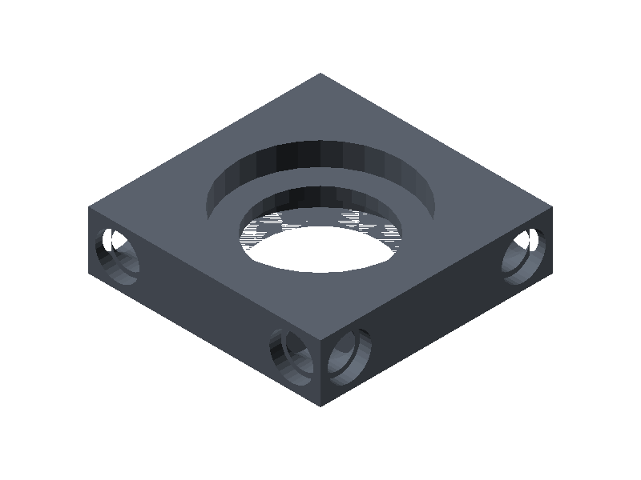
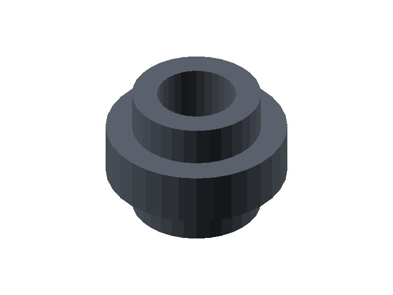
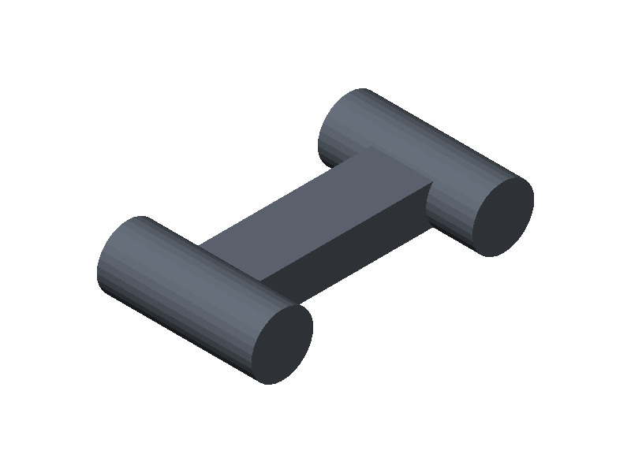
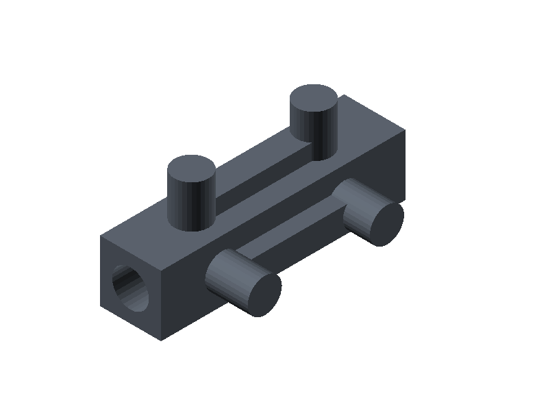

<div align="center">

🌐 **Português** | [English](README.en.md)

# FusionBrick

**Sistema de design modular open-source para makers, engenheiros e entusiastas.**

[](LICENSE)
[](https://openscad.org)
[](CHANGELOG.md)

</div>

---

FusionBrick é um sistema de componentes modulares paramétricos para impressão 3D. Qualquer componente conecta em qualquer outro — em qualquer face, em qualquer direção — via press-fit, sem ferramentas.



---

## Componentes

| Componente | Preview | Função | Fonte |
| --- | :---: | --- | --- |
| **ATOM** |  | Unidade cúbica. Furos passantes em 6 faces. | `impl/openscad/atom.scad` |
| **PLATE** |  | Superfície plana. Furos alinhados ao ATOM. | `impl/openscad/plate.scad` |
| **LINK** |  | Conector universal entre quaisquer dois furos. | `impl/openscad/link.scad` |
| **BRIDGE** |  | Junção coplanar invisível entre duas PLATEs. | `impl/openscad/bridge.scad` |
| **CORNER** |  | Viga de canto. Une duas PLATEs a 90° via furos de borda. | `impl/openscad/corner.scad` |

---

## Parâmetros Globais

Todos os parâmetros abaixo devem ser iguais entre os componentes para garantir compatibilidade.

```
cell_size     = 20mm   // unidade base da grade
hole_d        = 10mm   // diâmetro do furo
relief_depth  = 2mm    // profundidade do rebaixo
relief_margin = 2mm    // margem do rebaixo
tolerance     = 0.2mm  // tolerância de impressão (ajuste por impressora)
canal_d       = 6mm    // canal para fios em todo conector (0 = fechado)
```

Premissas do sistema: [spec/design-system.md](spec/design-system.md) · Lei do Grid e junções: [spec/rules.md](spec/rules.md).

---

## Início Rápido

**Requisitos:** OpenSCAD 2021+, impressora FDM, PLA ou PETG.

### 1. Instalar OpenSCAD

Via [download direto](https://openscad.org/downloads.html) ou via asdf:

```bash
asdf plugin add openscad https://github.com/gabrielelana/asdf-openscad
asdf install  # lê a versão de .tool-versions (2021.01)
```

### 2. Clonar e abrir

```bash
git clone https://github.com/wguilherme/FusionBrick.git
cd FusionBrick
open impl/openscad/atom.scad
```

Dentro do OpenSCAD: ajuste os parâmetros no painel lateral (ex: `atom_size`, `hole_d`, `border_radius`) → `F6` para renderizar → `File → Export → Export as STL`.

### 3. Gerar previews e STLs via Make

```bash
make preview            # renders/img/*.png — imagem isométrica de cada componente
make preview-animated   # renders/img/*.gif — giro 360° de cada componente
make build              # renders/stl/*.stl — STL pronto para fatiar
make assembly           # examples/*/assembly*.png — montagens isométricas (normal + explodida)
make assembly-animated  # examples/*/assembly.gif — giro 360° com explode/recolhe em loop
```

Para sobrescrever a cor dos componentes no preview:

```bash
make preview PART_COLOR="[0.8, 0.2, 0.1]"  # valores 0.0–1.0 (RGB)
```

Velocidade/suavidade dos GIFs animados:

```bash
make preview-animated ANIM_DELAY=10   # delay entre frames em 1/100s (padrão: 15)
make preview-animated ANIM_FRAMES=72  # frames por volta — mais suave (padrão: 36)

make assembly-animated ASM_ANIM_DELAY=10    # delay entre frames (padrão: 5)
make assembly-animated ASM_ANIM_FRAMES=96   # frames no loop completo (padrão: 72)
make assembly-animated ASM_ANIM_EXPLODE=20  # afastamento máximo em mm (padrão: 12)
make assembly-animated ASM_ANIM_SPIN=360    # habilita o giro completo (padrão: 0 — câmera isométrica fixa)
make assembly-animated ASM_ANIM_SPEED=2     # 2x mais rápido (padrão: 1; 0.5 = metade da velocidade)
```

Por padrão a câmera fica travada no ângulo isométrico (45°/54.7°) e a animação só abre/recolhe a montagem.

---

## Estrutura

```text
FusionBrick/
├── spec/                   ← especificação independente de ferramenta
│   ├── design-system.md    ← premissas do sistema
│   ├── params.md           ← parâmetros globais
│   ├── rules.md            ← Lei do Grid, interfaces, junções
│   └── parts/              ← spec de cada peça
├── impl/
│   ├── openscad/           ← implementação OpenSCAD ✅
│   ├── fusion360/          ← planejado
│   └── manual/             ← planejado
├── renders/
│   ├── img/                ← previews PNG
│   └── stl/                ← STLs exportados
└── examples/               ← montagens de exemplo (make assembly)
```

---

## Roadmap

### v0.1.0 — Fundação ✅

- [x] ATOM, PLATE, LINK
- [x] Implementação OpenSCAD
- [x] Especificação do sistema

### v0.2.0 — Junções & Interface de Borda ✅

- [x] Interface de borda: furos Ø3 + rebaixos nas laterais das PLATEs
- [x] BRIDGE — junção coplanar invisível (dowels + alma enterrada)
- [x] CORNER — viga de canto 90° com nervuras e canal para fio
- [x] Canal para circuito elétrico por padrão em todo conector
- [x] Lei do Grid formalizada (`spec/design-system.md`, `spec/rules.md`)
- [x] `make assembly` — montagens isométricas com teste de colisão

### v0.3.0 — Paramétrico

- [ ] Seleção de padrão de furos (bordas, cantos, todos)
- [ ] Suporte multi-escala (10mm, 20mm, 30mm)
- [ ] Upload MakerWorld PMM

### v0.4.0+ — Futuro

- [ ] Canais para condução elétrica
- [ ] Conectores magnéticos
- [ ] Plugin Fusion 360

---

## Implementações

| Implementação | Status |
| --- | --- |
| OpenSCAD | ✅ Ativo |
| Fusion 360 | 🔜 Planejado |
| FreeCAD | 🔜 Planejado |
| MakerWorld PMM | 🔜 Planejado |

Quer contribuir? [Abra uma issue](https://github.com/wguilherme/FusionBrick/issues) ou envie um PR.

---

Feito com ❤️ por makers, para makers — [@wguilherme](https://github.com/wguilherme)
