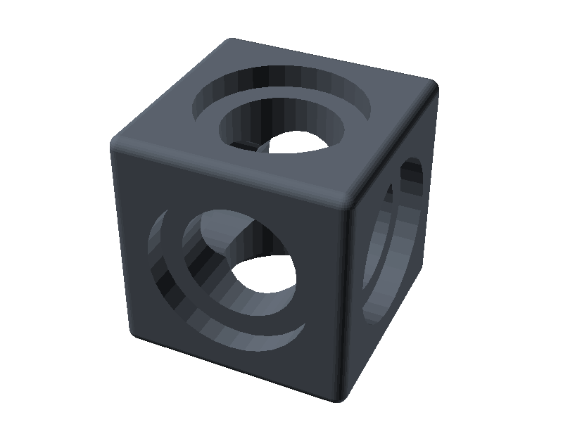
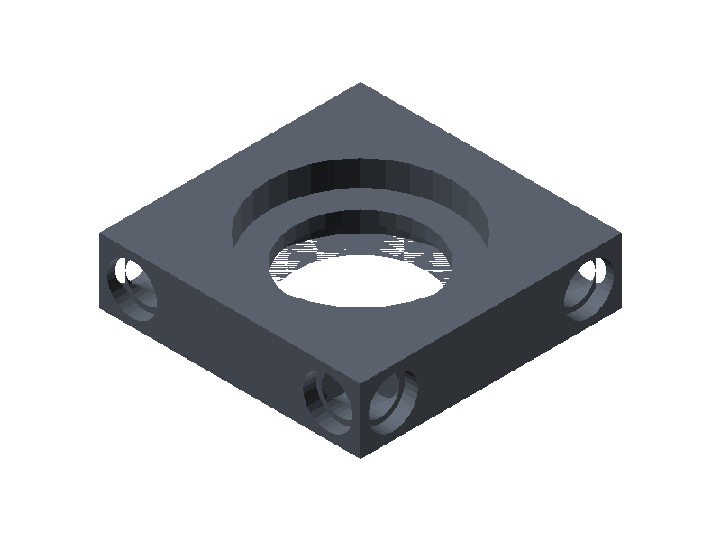
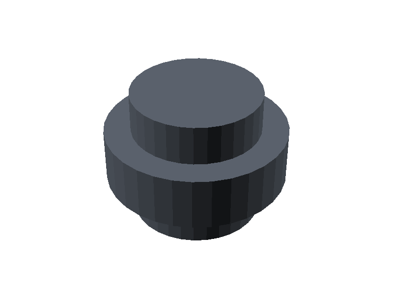

<div align="center">

🌐 **Português** | [English](README.en.md)

# FusionBrick

**Sistema de design modular open-source para makers, engenheiros e entusiastas.**

[](LICENSE)
[](https://openscad.org)
[](CHANGELOG.md)

</div>

---

FusionBrick é um sistema de componentes modulares paramétricos para impressão 3D. Qualquer componente conecta em qualquer outro — em qualquer face, em qualquer direção — via press-fit, sem ferramentas.


---

## Componentes

| | **ATOM** | **PLATE** | **LINK** |
| --- | --- | --- | --- |
| |  |  |  |
| **Função** | Unidade cúbica. Furos passantes em 6 faces. | Superfície plana. Furos alinhados ao ATOM. | Conector universal entre quaisquer dois furos. |
| **Fonte** | `impl/openscad/atom.scad` | `impl/openscad/plate.scad` | `impl/openscad/link.scad` |

---

## Parâmetros Globais

Todos os parâmetros abaixo devem ser iguais entre os componentes para garantir compatibilidade.

```
cell_size     = 20mm   // unidade base da grade
hole_d        = 10mm   // diâmetro do furo
relief_depth  = 2mm    // profundidade do rebaixo
relief_margin = 2mm    // margem do rebaixo
tolerance     = 0.2mm  // tolerância de impressão (ajuste por impressora)
```

---

## Início Rápido

**Requisitos:** OpenSCAD 2021+, impressora FDM, PLA ou PETG.

### 1. Instalar OpenSCAD

Via [download direto](https://openscad.org/downloads.html) ou via asdf:

```bash
asdf plugin add openscad https://github.com/gabrielelana/asdf-openscad
asdf install  # lê a versão de .tool-versions (2021.01)
```

### 2. Clonar e abrir

```bash
git clone https://github.com/wguilherme/FusionBrick.git
cd FusionBrick
open impl/openscad/atom.scad
```

Dentro do OpenSCAD: ajuste os parâmetros no painel lateral (ex: `atom_size`, `hole_d`, `border_radius`) → `F6` para renderizar → `File → Export → Export as STL`.

### 3. Gerar previews e STLs via Make

```bash
make preview   # renders/img/*.png — imagem de cada componente
make build     # renders/stl/*.stl — STL pronto para fatiar
```

Para sobrescrever a cor dos componentes no preview:

```bash
make preview PART_COLOR="[0.8, 0.2, 0.1]"  # valores 0.0–1.0 (RGB)
```

---

## Estrutura

```
FusionBrick/
├── spec/          ← especificação independente de ferramenta
├── impl/
│   ├── openscad/  ← implementação OpenSCAD ✅
│   ├── fusion360/ ← planejado
│   └── manual/    ← planejado
├── renders/
│   ├── img/       ← previews PNG
│   └── stl/       ← STLs exportados
└── examples/      ← montagens de exemplo
```

---

## Roadmap

### v0.1.0 — Fundação ✅

- [x] ATOM, PLATE, LINK
- [x] Implementação OpenSCAD
- [x] Especificação do sistema

### v0.2.0 — Paramétrico

- [ ] Seleção de padrão de furos (bordas, cantos, todos)
- [ ] Suporte multi-escala (10mm, 20mm, 30mm)
- [ ] Upload MakerWorld PMM

### v0.3.0+ — Futuro

- [ ] Canais para condução elétrica
- [ ] Conectores magnéticos
- [ ] Plugin Fusion 360

---

## Implementações

| Implementação | Status |
| --- | --- |
| OpenSCAD | ✅ Ativo |
| Fusion 360 | 🔜 Planejado |
| FreeCAD | 🔜 Planejado |
| MakerWorld PMM | 🔜 Planejado |

Quer contribuir? [Abra uma issue](https://github.com/wguilherme/FusionBrick/issues) ou envie um PR.

---

Feito com ❤️ por makers, para makers — [@wguilherme](https://github.com/wguilherme)
